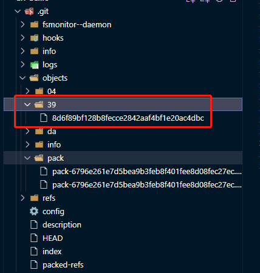

# git-demo

a demo to learn git deeply

## git init 初始化

### 显示出.git 本地文件

+ 进入vscode 配置，搜索 `exclude`，删除 `**/.git` 在vscode 项目中即可看到 .git 文件仓库
+ 查看.git 中 objects 文件夹
+ 编辑该README 文件，生成文件 hash

```shell
# 获取 hash-object
git hash-object -w README.md # 398d6f89bf128b8fecce2842aaf4bf1e20ac4dbc ， 每次文件变动，执行该命令会生成新的hash, 用于标识文件是否修改

```

> objects 目录下发现多了一个目录，目录名是 hash 前两位，剩下的是文件名：

+ 通过hash 查看文件内容 

```shell
git cat-file -p 398d6f89bf128b8fecce2842aaf4bf1e20ac4dbc # 通过该命令可以查看到该 hash 对应文件内容, -p 是 print 

git cat-file -t 398d6f89bf128b8fecce2842aaf4bf1e20ac4dbc # 打印出 blob  -t: type 
```



> 目录是 tree 对象，文件内容是 blob 对象
> 在 tree 对象里存储每个子目录和文件的名字和 hash
> 在 blob 对象里存储文件内容
> tree 对象里通过 hash 指向了对应的 blob 对象。

### 文件hash 算法

对“对象类型 内容长度\0内容” 的字符串 sha1 之后的值转为 16 进制字符串。

```js
const crypto = require('crypto');

function hash(content) {
    const sha1 = crypto.createHash('sha1');
    sha1.update(content);
    return sha1.digest('hex');
}

console.log(hash('blob 3\0hashcontent'))
```

更新暂存区用 update-index

```shell
git update-index --add --cacheinfo 100644 398d6f89bf128b8fecce2842aaf4bf1e20ac4dbc text.txt
```

> git add 的底层就是执行了 git update-index

暂存区的内容写入版本库的话只要执行下 write-tree

```shell
git write-tree
```

> 以上就是 git commit 原理

找到对应版本的 tree 的 hash，然后再一层层找到对应的 blob 对象，读取内容再写入文件
> git revert 原理

### commit 对象

为了解决每个版本都要自己记住顶层 tree 的 hash
可以通过 commit-tree 命令把某个 tree 对象创建一个 commit 对象

```shell
echo 'zxy xxx' | git commit-tree 9ef7e5
```
